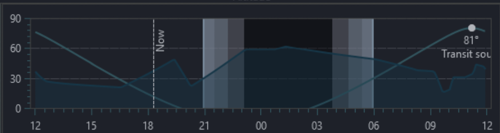
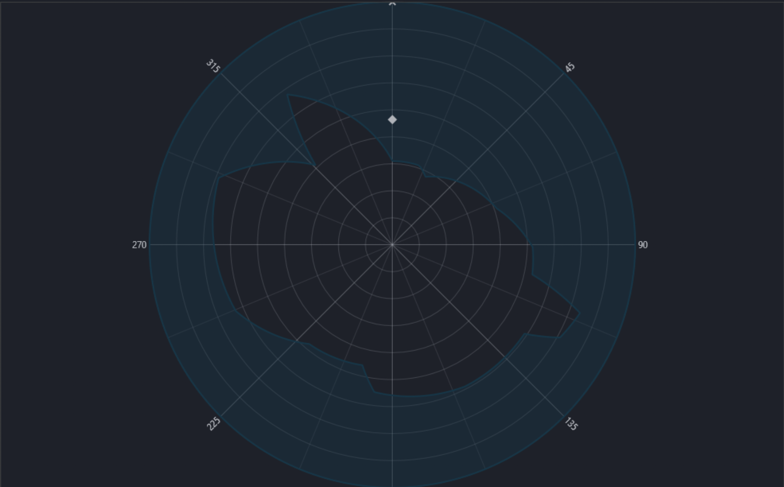

# SkyPath

## functionality

SkyPath is a single-page web application that draws a trajectory of a sky object in the sky at a given date.

SkyPath draws the sky map with cardinal points N,S,E,W, azimutal grid and horizon.

Horizon is defined in a NINA-compatible file that can be uploaded.

The file is a plain text file where each row defines two numbers separated by space. First is an azimuth (0-359) and the second one is horizon altitude in degrees at the given azimuth direction.

SkyPath is able to draw two type of charts: Altitude chart where the sky is unwrapped in cylindrical projection displaying the altitude of the given celestial object at any given time (centered around the night time for the given date). It displays day and night and twilight/dawn transitions, object trajectory and horizon.

Second type of chart is a circular down-top view of the sky with outer bound matching altitude 0º and the center of the circle is zenith - altitude 90º. North is at the top. Trajectory is shown, but no day/night/twilight/dawn. Horizon is wrapped around the outer boundary of the view.

The SkyPath also calculates following times:

 - object above 0º
 - object above horizon
 - object at the max altitude
 - object sets at the horizon
 - object sets at 0º

 Also times of:

 - Sunset
 - Sunrise
 - Astronomical/Civil/Nautical Twilight/Dawn

## Observatories

The user can create named "observatories" — an observer location (latitude/longitude) and a horizon bundled together.

 - Observatories are saved to the browser's local storage.
 - The user can create, select, edit and delete observatories.
 - The selected observatory provides the location and horizon used for all calculations and charts.

Extended goals:
 - draw moon trajectory and calculate moonrise, moonset and the moon phase

## Implementation details

Implemented in Javascript/Typescript. If possible, does not require backend. Loading external resources (fonts, graphics, CDN assets) is allowed — only a backend is excluded.

The project will be part of the voronin.cc site. Open question: deployed as a 3rd-level domain (e.g. skypath.voronin.cc) or as a path (voronin.cc/skypath) — not yet decided.

Built-in Messier catalog and Solar system planets. 
Horizon file can be uploaded/pasted 

Framework:
 - undecided.
Should be rather popular, maintained, easy to setup and keep up-to-date and lightweight.

## Styling

Visual styling must be consistent with the main website (voronin.cc, sources in `../voronin_cc`):

 - dark theme: background `rgb(16, 31, 37)`, beige text `#f5f5dc`
 - "Red Hat Display" font for UI, "Fira Code" for monospace/data
 - accent colors: links `#228da8`, highlights `#74bbf1`, headings `#c3cfec`
 - cards/panels: `rgba(1, 20, 29, 0.5)` background, `1px solid rgba(98, 169, 255, 0.3)` border, 10px radius
 - rounded pill buttons, 0.3s ease transitions