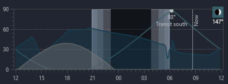
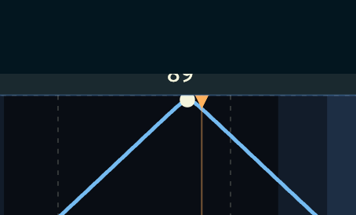

Altitude chart:
 - show cardinal directions at the top (N,S,E,W)
 - show the moon as in nina chart 
 - The transit altitude is cut off 
 - Remove the text below the chart - it's useless
 - Draw dates for the first and last time tick
 - Click on the chart should set the "selected hour" to that position

All-sky view:
 - remove the text below the chart "The whole sky from directly overhead: centre is the zenith, the rim is the horizon, north is up. The shaded ring is your horizon; dots mark whole hours along the track."
 - show the moon trajectory and phase like in NINA chart
 
Observatory
 - Remove "?" button
 - replace text with icons for Add, Delete, Edit, and Location buttons

General:

 - Search and Results tabs should look like tabs and not buttons
 

