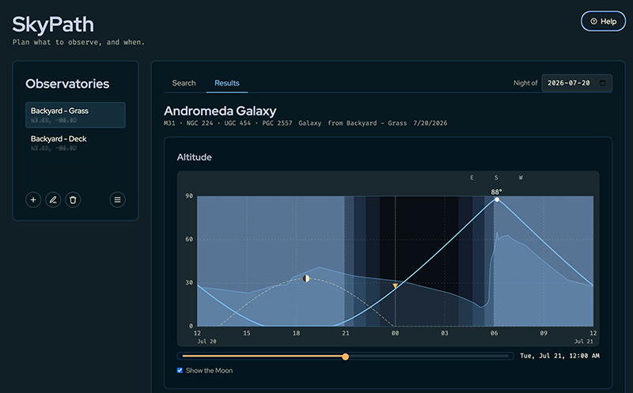

# SkyPath

A static single-page web app for planning a night of astronomical observation. Pick a target, a date and a location, and see where the object goes across the sky that night taking _your_ horizon into account.

**NOTE**: This project violates the Codeberg terms of use related to LLM-generated content. I respect Codeberg's decision and will stop developing it here and will move the main repo GitHub. 



No backend, no accounts, no server-side state. Everything runs in the browser and everything you save stays in `localStorage`.

## Why

I like planning a session in [Telescopius](https://telescopius.com), but it doesn't know what obstructs my view. In NINA, I can create a custom horizon and it will overlay it on the target trajectory when planning, but NINA is running on a separate computer, which is usually attached to a telescope and requires VNC or RDP to connect to it.

SkyPath combines a (very much) simplified NINA search and a NINA horizon and displays it to you in your browser.

## What it does

SkyPath draws **two charts of the night, both centred on local midnight** (the window runs roughly noon → noon):

- **Altitude chart** — the sky unwrapped: object altitude against time, with day, twilight and night shaded behind it, and your horizon drawn as the obstruction along the object's own azimuth track.
- **All-sky chart** — a circular down-top view. Rim is altitude 0°, centre is the zenith, north at the top. The obstruction is drawn as a wall around the edge and the target path as it moves across the sky.

A time slider under the charts links them: both flag the same moment with a marker. There is also a toggle to show the moon path and its phase.

Additionally, SkyPath calculates **event times**, in a 24-hour clock, local timezone:

- object rises above 0° / above your horizon
- object at maximum altitude (transit), with the altitude and direction
- object sets below your horizon / below 0°
- sunset, sunrise, and civil / nautical / astronomical twilight and dawn
- moonrise, moonset and the moon phase

SkyPath bundles about 15 000 deep-sky objects (Messier, NGC, IC, Sharpless 2 and LDN) plus the solar system planets, searchable by any designation or common name (`M13`, `messier 13`, `NGC 6205`, bare `6205`, `Sh2-155`, `Hercules`). The catalogue model is multi-catalogue by design: an object belongs to many catalogues and carries many names, so M13 and NGC 6205 are one entry with two numbers, not two rows.

**Observatories** — named combination of a location and a horizon, created, edited, selected and deleted in-app, persisted to `localStorage`. The selected one drives every calculation and both charts.

**Horizons** are NINA-compatible plain text: one `azimuth altitude` pair per line, azimuth 0–359°. Upload a file or paste it.

### Development

```sh
npm test           # all three Vitest projects
npm run check      # svelte-check + tsc
npm run format     # Prettier
npm run catalog:build   # regenerate catalogue JSON from OpenNGC and VizieR
```

## Built with

[Svelte 5](https://svelte.dev) + TypeScript on [Vite](https://vite.dev), with [astronomy-engine](https://github.com/cosinekitty/astronomy) for all ephemeris math. Both charts are hand-rolled SVG — no charting library. Tests run on [Vitest](https://vitest.dev) and [Playwright](https://playwright.dev).

## Use of AI

This is the first project that I completely vibe coded. I've generated programs with AI before, but I always check the code afterwards to make sure I understand what it does and that it does it efficiently. This project is not it.

I am not a front-end developer. I can do some JS coding and just to have the app to look as I want to would have taken me a week.

I decided that I don't really care how it works (also Claude Code with Opus/Fable/Sonnet 5 combination generates fine code. I still find ways to improve it, but all-in-all it's not bad at all) as long as it works fast enough and looks the way I want.

## Data and credits

Messier, NGC and IC are generated from [OpenNGC](https://github.com/mattiaverga/OpenNGC), licensed **CC-BY-SA-4.0** — attribution is a licence obligation and is shown in the app's credits. Sharpless 2 and LDN come from the VizieR tables VII/20 (Sharpless 1959) and VII/7A (Lynds 1962), cited in the same credits. The JSON under `src/lib/catalog/data/` is generated by `npm run catalog:build`; don't hand-edit it.

## Known limitations

- Times display in the browser's local timezone.

## Licence

[GPL-3.0](LICENSE).
